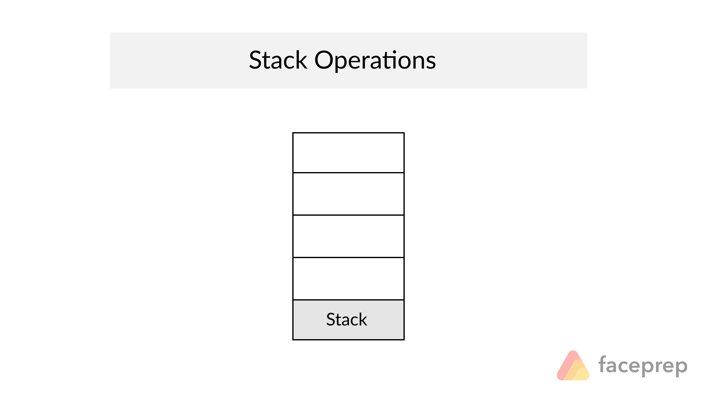

# Stacks and Queues 
## what is stacks :
*  A stack is a data structure that consists of Nodes. Each Node references the next Node in the stack, but does not reference its previous.
 * Common terminology for a stack is

* Push - Nodes or items that are put into the stack are pushed
* Pop - Nodes or items that are removed from the stack are popped. When you attempt to pop an empty stack an exception will be raised.
* Top - This is the top of the stack.
* Peek - When you peek you will view the value of the top Node in the stack. When you attempt to peek an empty stack an exception will be raised.
* IsEmpty - returns true when stack is empty otherwise returns false

* We use in stack two concepts FILO : first in last out 
     * LIFO : last in first out 

* Push take  O(1) : This is because it takes the same amount of time no matter how many Nodes (n) you have in the stack.

* Pop  take O(1) : Popping a Node off a stack is the action of removing a Node from the top. When conducting a pop, the top Node will be re-assigned to the Node that lives below and the top Node is returned to the user.

## What is a Queue
* Common terminology for a queue is

* Enqueue - Nodes or items that are added to the queue.
* Dequeue - Nodes or items that are removed from the queue. If called when the queue is empty an exception will be raised.
* Front - This is the front/first Node of the queue.
* Rear - This is the rear/last Node of the queue.
* Peek - When you peek you will view the value of the front Node bin the queue. If called when the queue is empty an exception will be raised.
* IsEmpty - returns true when queue is empty otherwise returns false.

* Queues follow these concepts:

    * FIFO
        * First In First Out

            This means that the first item in the queue will be the first item out of the queue.

    * LILO
        * Last In Last Out

            This means that the last item in the queue will be the last item out of the queue.

* Enqueue O(1) :operation in time because it does not matter how many other items live in the queue (n); it takes the same amount of time to perform the operation

* Dequeue O(1) : operation in time because it doesn’t matter how many other items are in the queue, you are always just removing the front Node of the queue

## Finally when I try to understand the Queues 

