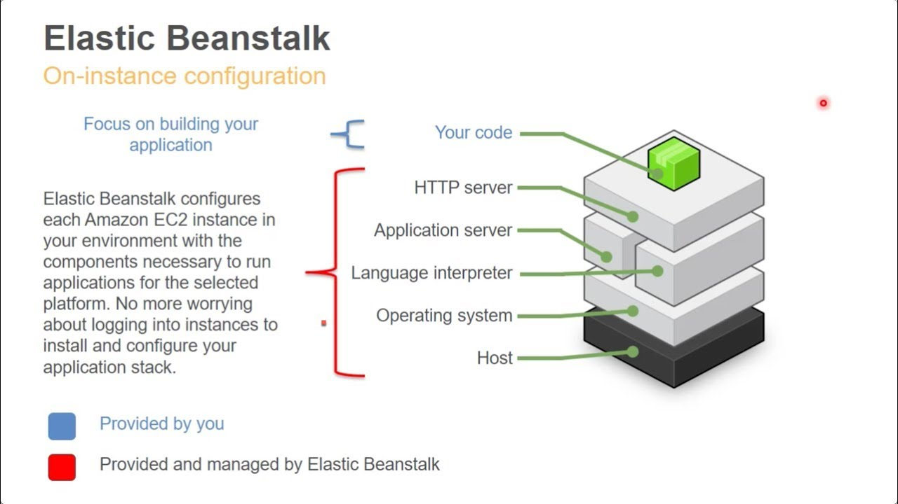

# AWS
* Amazon web service 
    * Amazon Elastic Compute Cloud (Amazon EC2) offers the broadest and deepest compute platform, with over 500 instances and choice of the latest processor, storage, networking, operating system, and purchase model to help you best match the needs of your workload. We are the first major cloud provider that supports Intel, AMD, and Arm processors, the only cloud with on-demand EC2 Mac instances, and the only cloud with 400 Gbps Ethernet networking. We offer the best price performance for machine learning training, as well as the lowest cost per inference instances in the cloud. More SAP, high performance computing (HPC), ML, and Windows workloads run on AWS than any other cloud.
## use casses
* Run cloud-native and enterprise applications
Amazon EC2 delivers secure, reliable, high-performance, and cost-effective compute infrastructure to meet demanding business needs.
* Scale for HPC applications
Access the on-demand infrastructure and capacity you need to run HPC applications faster and cost-effectively.
* Develop for Apple platforms
Build, test, and sign on-demand macOS workloads. Access environments in minutes, dynamically scale capacity as needed, and benefit from AWS’s pay-as-you-go pricing
* Train and deploy ML applications
Amazon EC2 delivers the broadest choice of compute, networking (up to 400 Gbps), and storage services purpose-built to optimize price performance for ML projects.

### what is EC2 
* Amazon Elastic Compute Cloud (Amazon EC2) provides secure, resizable compute capacity in the cloud, EC2 also allows users to build apps to automate scaling according to changing needs and peak periods, and makes it simple to deploy virtual servers and manage storage, lessening the need to invest in hardware and helping streamline development processes.

* AWS Elastic Beanstalk is an easy-to-use service for deploying and scaling web applications and services developed with Java, .NET, PHP, Node.js, Python, Ruby, Go, and Docker on familiar servers such as Apache, Nginx, Passenger, and IIS.

You can simply upload your code and Elastic Beanstalk automatically handles the deployment, from capacity provisioning, load balancing, auto-scaling to application health monitoring. At the same time, you retain full control over the AWS resources powering your application and can access the underlying resources at any time.

There is no additional charge for Elastic Beanstalk - you pay only for the AWS resources needed to store and run your applications.