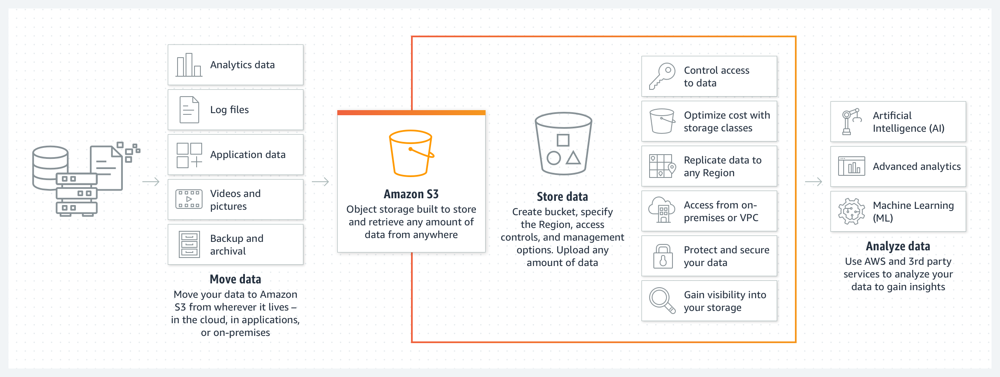

# AWS: S3 and Lambda
* What is Amazon S3?
s an object storage service offering industry-leading scalability, data availability, security, and performance.
* Name some use cases for Amazon S3.
use case, such as data lakes, cloud-native applications, and mobile apps
* Name some benefits of using Amazon S3
 cost-effective storage classes and easy-to-use management features, you can optimize costs, organize data, and configure fine-tuned access controls to meet specific business, organizational, and compliance requirements
 

 ## What is AWS Lambda?
 * AWS Lambda is a serverless computing service provided by Amazon Web Services (AWS). Users of AWS Lambda create functions, self-contained applications written in one of the supported languages and runtimes, and upload them to AWS Lambda, which executes those functions in an efficient and flexible manner.

 ### How does AWS Lambda work?
 * Each Lambda function runs in its own container. When a function is created, Lambda packages it into a new container and then executes that container on a multi-tenant cluster of machines managed by AWS. Before the functions start running, each function’s container is allocated its necessary RAM and CPU capacity. Once the functions finish running, the RAM allocated at the beginning is multiplied by the amount of time the function spent running. The customers then get charged based on the allocated memory and the amount of run time the function took to complete.

 ### Why is AWS Lambda an essential part of the Serverless architecture?
 * When building Serverless applications, AWS Lambda is one of the main candidates for running the application code. Typically, to complete a Serverless stack you’ll need:

    * a computing service;
    * a database service; and
    * an HTTP gateway service.

    ### What are the most common use cases for AWS Lambda?
* Due to Lambda’s architecture, it can deliver great benefits over traditional cloud computing setups for applications where:

    * individual tasks run for a short time;
    * each task is generally self-contained;
    * there is a large difference between the lowest and highest levels in the workload of the application.
    ### Creating AWS Lambda functions using the Serverless Framework
* We recommend getting started with AWS Lambda by using Serverless Framework. With the Serverless Framework, you can create Lambda functions using the tools you’re familiar with on your local machine and deploy to AWS in seconds. With this approach, your function’s code and configuration are located in the same Git repository which makes collaboration, change tracking and deployment of Lambda functions easier.

1. Install Serverless Framework on your machine:
‍
$ npm install serverless -g
‍
2. Create a new service:
‍
$ serverless
‍
3. Add the resources your function needs to the serverless.yml file. Check out the AWS Intro doc for an example of this file and the list of options you can configure there.
‍
4. Add code to your service. See the Serverless AWS provider docs for specific steps you can follow to create your functions.
‍
5. Deploy to AWS by running the deploy step:
‍
$ serverless deploy

That’s it! Your function will be deployed and you’ll see the URL of the function’s endpoint in your console.

## A Content Delivery Network (CDN)
*  is a geographically distributed group of servers that work together to provide fast delivery of Internet content. A CDN allows for the fast transfer of data needed for loading Internet content including HTML pages, javascript files, stylesheets, images, and videos.

### What does this mean for an SMB?
* CDNs are something that larger companies are more likely to implement. The main reasons why company want to use CDNs are to improve Internet website load speeds, content delivery speeds, and to reduce the likelihood of falling victim to and improve defenses against Distributed Denial of Service attacks (DDoS).
 
* A smaller company probably doesn’t need to improve website load speeds with a CDN as they typically don’t have an overwhelming amount of traffic. A Distributed Denial of Service attack may pose a potential threat against gambling companies or other mid-to-large enterprises such as banks or defense contractors. DDoS attacks are rarely used against SMB’s unless they upset a hacker group. CyberHoot is not saying a denial of service attack won’t happen, but the cost of protection is too much for most SMBs to afford.
 
* CyberHoot’s best advice to an SMB is to know what a CDN is, and at most, establish a relationship with a CDN protection vendor without paying for protection. DDoS protection vendors include: Arbor Networks, AT&T, Verizon, and Akamai.
 
* Mid-to-Large enterprises should have contracts in place to protect themselves in seconds when hit with a DDOS attack. SMB’s should not. Although, if you are looking to employ a CDN; Akamai, Cloudflare and Arbor Networks all operate CDN’s in addition to DDOS solutions.