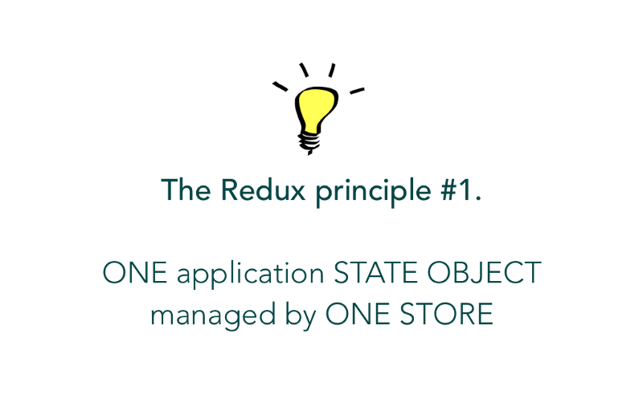
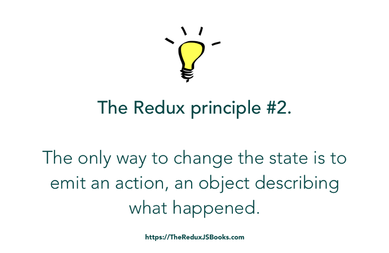
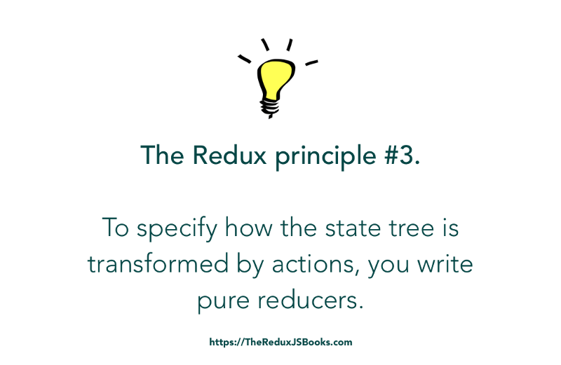

# Redux
* Redux is a predictable state container for JavaScript apps.

   It helps you write applications that behave consistently, run in different environments (client, server, and native), and are easy to test. On top of that, it provides a great developer experience, such as live code editing combined with a time traveling debugger.

* Redux provides a solid, stable, and mature solution to     managing state in your React application. Through a handful   of small, useful patterns, Redux can transform your application from a total mess of confusing and scattered state, into a delightfully organized, easy to understand modern JavaScript powerhouse.

  The principles of Redux aren't new, but they are packaged and presented for you in an easy to use a library that not only elevates your applications but also improves your general understanding of building JavaScript UIs.

* The Redux Store can be likened to the Bank Vault. It holds the state of your application — and keeps it safe.

### Create a React Redux App
The recommended way to start new apps with React and Redux is by using the official Redux+JS template or Redux+TS template for Create React App, which takes advantage of Redux Toolkit and React Redux's integration with React components.

### Redux + Plain JS template
npx create-react-app my-app --template redux







* src/App.js
```
import React, { Component } from "react";
import HelloWorld from "./HelloWorld";

class App extends Component {
 state = { 
  tech : "React"
}
render() {
  return <HelloWorld tech={this.state.tech}/>
}
}

export default App;
```
### Creating a Redux Store
* If the <App /> won’t manage it’s state, then we have to create a Redux Store to manage our application state.


* To create a manageable state-keeping facility for our application, we don’t need mechanical engineers. We’ll do so programmatically using some of the APIs Redux avails to us.

* Here’s what the code to create a Redux store looks like:
```
import { createStore } from "redux"; //an import from the redux library
const store = createStore();  // an incomplete solution - for now.
```